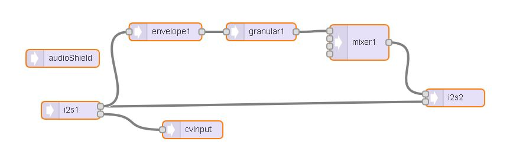

# EuroshieldGranular
Granular Sampler for Euroshield Module by 1010Music

## Function
The sketch begins sampling when the Gate Input is HIGH. After sampling is completed the sample is freezed and played back continously until the Gate is LOW. The playback Speed/Ratio can be changed on the fly via the CV-Input and changes the pitch of the sample. Try sampling some audio books and modulate the ratio with a turing machine :)

When the granular effect begins, it plays back the dry signal for the length of the grain. The mixer behind the effect opens when the playback of the firtstmost dry sample stopped (Gate goes HIGH + grainLength) and closes when the Gate closes. So the playback starts after the time of the grain lenght has passed (It needs to 'record' the sample first) 

Find more Info here: https://www.pjrc.com/teensy/gui/index.html?info=AudioEffectGranular

Make sure the length of the gate is longer than the grain length. (at least x2 to play back one complete grain.)

The grain size will update every time the Gate goes HIGH. 

To reflect different CV Input Voltages, the maximum Value of the CVIn is saved for mapping the playback ratio. To calibrate, you need to put in the maximum voltage one time after rebooting the module. To reset the value (chang of the CV Source) you need to reboot the module. 

*When the Sample starts or ends at a high amplitude a clicking sound can occur. To prevent this, an envelope is used with a 5 ms attack and 5m release, timed at the begin and end of the sample.* (Not working completely at the moment, see Known Issues)

## In/Outs
* Input 1:	  Audio Input
* Input 2:	  CV Input for Playback Ratio (0.125 - 3.0)
* Output 1: 	Output from Granual Effect
* Output 2:	  Dry Output

* MIDI In:	  Gate IN (Digital Input
* MIDI Out:	  n/a
* Upper Pot:	Grain Size (20-1337 ms dependng on Memory Size)
* Lower Pot:	None
* LED 1:		  active when Gate is HIGH

*Note: The MIDI IN Port (Teensy Port 0) was used as a digital Input.*

## Modified Audio Library
The Sampler can sample up to ~1450 ms of Audio when using a modified Teensy Audio library. The variables in `effect_granular.h` and `effect_granular.cpp` needs to be changed from type int16_t to int32_t. The sketch then can use up to 64000 bytes sample memory. In my setup I was able to use ~ 59015 bytes (1337 ms (Yay!)) with 94% Memory Usage. (Teensy 3.5). The variable for the granular memory needs to be int32_t too. 

The modified files are in this repository, make a backup first and copy & replace them to: 

`C:\Program Files (x86)\Arduino\hardware\teensy\avr\libraries\Audio`

You should be able to use the sketch by default, the length of the sample then is ~725 ms.

To use the modified library look out for the definitions at the beginning of the code. Not Sure if it works with Teens 3.2 as I wasn't able to test. 

## TFT/Serial Out
My Euroshield uses a ILI9342 TFT to display the values, but the relevant parts of the code are commented out by default. Default is a Serial Out which prints out the values of both Voices every second. Look out for the Definitions at the beginning.

The TFT commands should be compatible with the Adafruit libraries.

## Known Issues
* There's still a clicking sound when the playback of a grain stops (I think). It's clearly audible when using waveforms (e.g. from a VCO) as an audio input. Haven't noticed it when using an audio book as the audio source. 
* I used a Teensy 3.5 for this sketch, at the moment I cannot test it with a Teensy 3.2

## ToDo
* Option to use a Trigger to start Sampling
* Option to select between CV In or using the lower Knob
* Adding SD-Card support
* Add Effects
* Option too choose between Freezing and Pitchshifting or use the two Ouputs for each of them (see https://www.pjrc.com/teensy/gui/index.html?info=AudioEffectGranular)
* Fork / Pull request for the modified Audio Library

